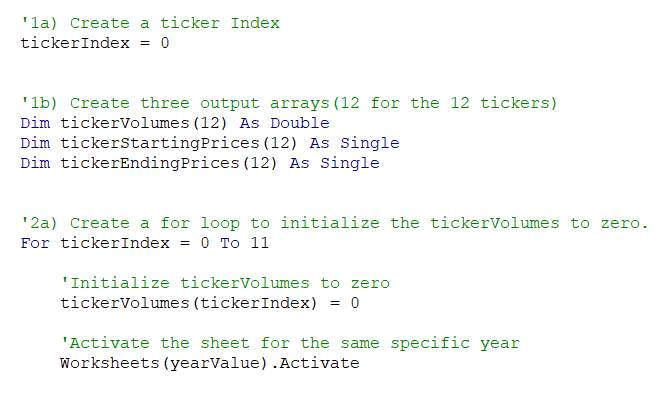
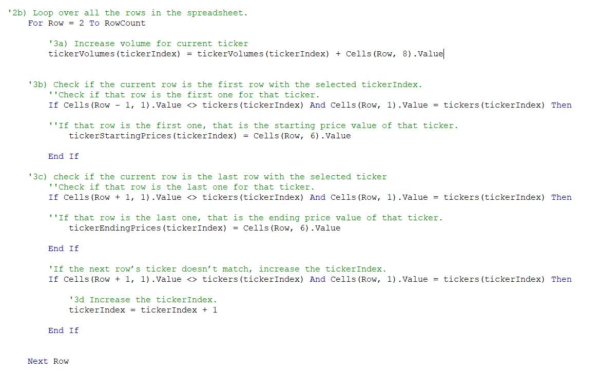
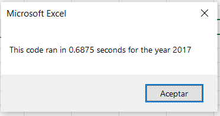
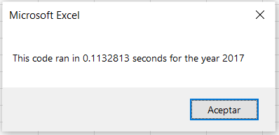
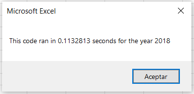
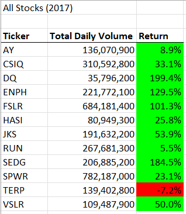
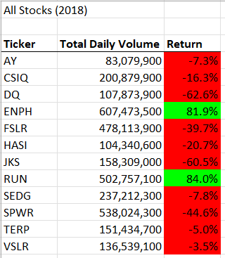

#### Challenge 2: Module 2
# Stocks with VBA

## Overview of the Project

The main purpose of Challenge 2 is to develop the ability to edit a code in VBA and  make it more useful for specific tasks. The action described is called “refactor” and can be used to improve a program already written. 
During the module, a code was created for Steve, who wanted to develop a program for his parents to show them the best investment option. Steve’s parents want to invest in a specific company but they did research about it neither other options. The code analyzed the dataset of two specific years and a small dataset.
In this case, he wants to use the program for the analysis of the entire stock market and be able to do it in a short period of time. The challenge of the module was to refactor the initial code, make it faster and more efficient using different functions learned during the course like “for” and “if”, within others. The analysis of all the stocks will help Steve’s parents to see all the best options and make an informed decision.

## Results

The original code made during the module works well with a small dataset but it was necessary to do some modifications to make it work for a bigger set. Some modifications can be seen in “Image 1. Refactored code Part 1”. The first change was declaring the “tickerIndex” variable and using it in different “for’s” and “if’s”. The variable helped for specification of each ticker and have some kind of control during the loops. 

The variable “tickerVolumes” was the one used to save the total Volume of each ticker. Other variables like “tickerStartingPrices” and “tickerEndingPrices” helped to see if the row of the loop had the first or the last ticker to know if tickerIndex needed to be increased, as it can be seen in “Image 2. Refactored code Part 2”. The loop is making the sum of the total volumes of each ticker, having twelve total results.

The timer starts after asking the year for the analysis and ends after printing and formatting the results. In the new script, the execution time was reduced for both years. The code ran in 0.6875 seconds with the original script in 2017 and now, with the changes mentioned before and others added to the script, the code ran in just 0.11 seconds for both years. The seconds for the first Code can be seen in “Image 3. Original Code Timer 2017” and the seconds of both years with the new code are in “Image 4. Refactored Code Timer 2017“ and “Image 5. Refactored Code Timer 2018”. An important note to add is that the timer starts just a few seconds after the user recibe the message box asking the year, so the time that the user takes to write the number is also contemplated. 

The code also shows the return of each ticker and format each cell depending if it is higher or lower than zero. The next two images: “Image 6. All Stocks 2017” and “Image 7. All Stocks 2018”, shows the final results of the code using 2017 and 2018 as years for the analysis. The results show that most of the tickers had positive returns in 2017, being “TERP” the exception. While in 2018, the only tickers with positive returns were “ENPH” and “RUN”. It is seen that most of the tickers were down within a year, so it can be deduced that those are not the best investment options. It is important for Steve to do a more explicit research to inform the final results.

## Summary

One of the most notorious advantages of refactoring a code is that it can increase the performance of the analysis and it can decrease the execution time of the program. The possibility of working in a code with a group of people at different times is also an advantage. More people working on one program and the chance of editing the code at any time can lead to great, different and complete ideas for the final result.

On the other hand, some of the disadvantages include the misunderstanding of the code or losing the main purpose of the macros with a lot of changes. Also, not commenting on the new lines and forgetting to specify the changes could make the code more messy.
Anyone can modify the code and there is no record of who made the edition and what were the changes. Also, if the document was closed after the changes of the code, it is not possible to return to the other version, that code is missed.
	
In the VBA script, the original code was clear and the main tasks were performed. The only two disadvantages were that the code couldn’t be able to obtain the result of more data and if the program was able to run, the time of execution was too long. 
The refactor of the script resulted in a more complex but simple code. The time of execution is reduced notoriously, which is more convenient because Steve will be able to work with a big dataset in short periods of time. One disadvantage of the refactored script is that it took more time to develop it and make it work.

